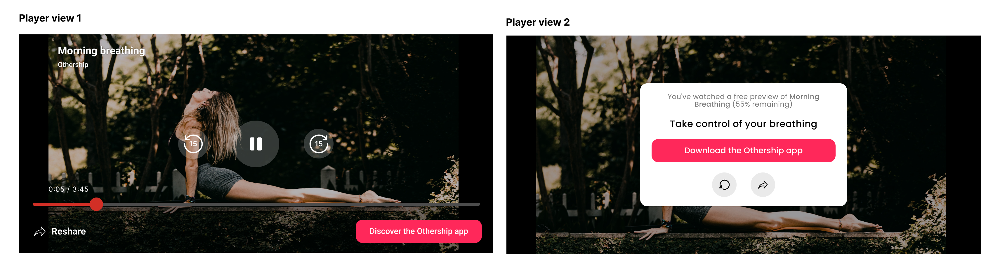

⚠️ Readme in progress 

<!--

## 👋 Welcome to our README.

# What is Envoy ? 

We help you (content apps) use your content to attract qualified leads. We do this by placing content previews inside a high-converting web flow we host on your behalf. 

<figure class="">
    
</figure>

There are two key ways for you to use the Envoy flow:
1. Through **gifting**: Allow your users to share. This requires a lightweight integration.
2. Through **marketing links**: generate links 


| Feature     | Short description |      Integration needed?        | Illustrated example |
| ----------- | ----------------- | ------------------------------- | ------------------  |
| Gifting      |   Enable your users to share with their friends.   |   Yes    |        |
| Marketing links   | Generate links in a no-code way               |    No    |        |
| Rewards   | Boost sharing by creating incentives for your users   |    Yes   |        |
| Analytics   | Generate links in a no-code way                     |    No, comes with gifting and marketing links |        |

How we access your content

Our security

``` 
import requests

api_key = "-----"
API_endpoint = "https://osh7r2l4od.execute-api.eu-west-2.amazonaws.com/prod/partner/create-link"
source = "----.mp3"
customer_journey_conf = {
    'userId': '100',
    'contentConfig': {
        'contentType': 'VIDEO',
        'contentId': 'your-content-id',
        'contentName': 'Your content name',
        'contentDescription': 'Your content name description',
        "common": {
            "media": {
                "poster": "https://your-poster-uri.com",
                "source": source
            }
        },
    }
}

response = requests.post(
    API_endpoint,
    headers={
        "x-api-key": api_key,
        "Accept": "application/json",
        "Content-Type": "application/json",
    },
    json=customer_journey_conf,
)

# response payload
```


1. One-to-one gifting. An integration is required. Integration required 
2. Marketing links: no need to integrate anything. 
3. Rewards: usually used with our gifting feature. Boost sharing by 
4. Analytics: 

 **Here are some ideas to get you started:**

 

🙋‍♀️ A short introduction - what is your organization all about?
🌈 Contribution guidelines - how can the community get involved?
👩‍💻 Useful resources - where can the community find your docs? Is there anything else the community should know?
🍿 Fun facts - what does your team eat for breakfast?
🧙 Remember, you can do mighty things with the power of [Markdown](https://docs.github.com/github/writing-on-github/getting-started-with-writing-and-formatting-on-github/basic-writing-and-formatting-syntax) -->


 
