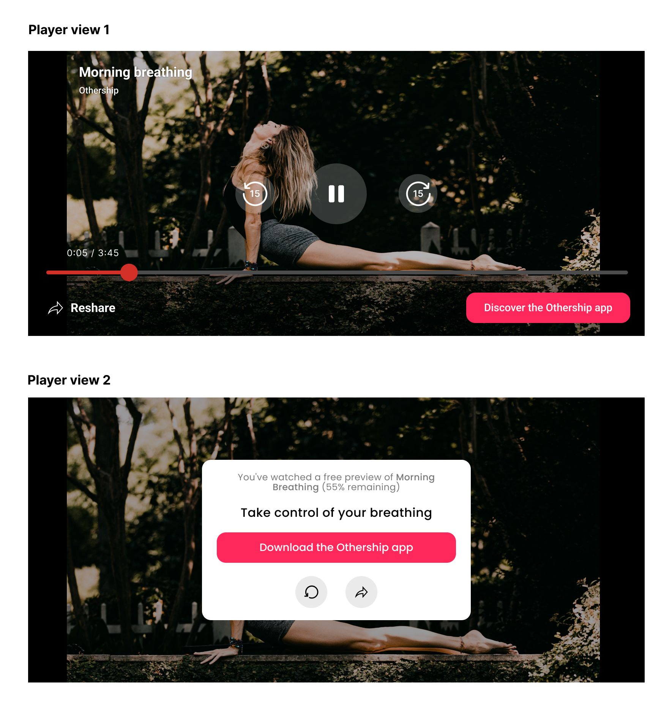

## 🌟 1 - What is Envoy ? 

#### 1.1. The Envoy flow
We help you (content apps) use your content to attract qualified leads. We do this by placing content previews inside a high-converting web flow we host on your behalf. 

<figure class="">
    
</figure>

#### 1.2. Features
There are two key ways for you to use the Envoy flow, through **gifting** and **marketing** links:

| Feature     | Short description |      Integration needed?        | Illustrated example |
| ----------- | ----------------- | ------------------------------- | ------------------  |
| Gifting      |   Enable your users to share with their friends.   |   Yes, an API call to get gift link + a gift button on the front-end    |        |
| Marketing links   | Generate links to be shared on social media or email campaigns   |    No, gets done from dash in a no-code way    |        |
| Rewards   | Boost sharing by creating incentives for your users   |    It depends on implementation (ie rewarding signups means integrating our pixel)   |        |
| Analytics   | Generate links in a no-code way                     |    No |        |

#### 1.3. Supported formats 
| Format     | Image |      
| ----------- | ----------------- |
| Video      |   Enable your users to share with their friends.   
|  Audio | Generate links to be shared on social media or email campaigns |
| Live audio and video |   Enable your users to share with their friends. |  
| Articles   | Boost sharing by creating incentives for your users   |   

## 🛠️ 2 - How do I integrate Gifting into my app?
After you've set up your space in the Envoy dash, here's the API call you'll need to make to get a link (example in Python). 

``` 
import requests

api_key = "-----"
API_endpoint = "https://api.envoy.is/partner/create-link"

payload = {
    'userId': '100',
    'contentConfig': {
        'contentType': 'VIDEO',
        'contentId': 'your-content-id',
        'contentName': 'Your content name',
        'contentDescription': 'Your content name description',
        "common": {
            "media": {
                "poster": "https://your-poster-uri.com",
                "source": "https://file_link.mp3"
            }
        },
    }
}

response = requests.post(
    API_endpoint,
    headers = headers,
    json=payload,
)
```

The respond payload will contain a `url` and a `userRemainingQuota`. Link format is:  `[your_app_name].envoy.gift/12345`. Read our [Tech docs](https://openapi.envoy.is/) for more.

## 🔒 3 - How do you access my content in a secure way?

Unless you're using our hosting feature inside of Marketing Links, we don't host your content but stream directly from your CDN's servers.
- We are pretty flexible when it comes to authentication, and support several strategies: access token-based auth, header-based auth.
- We also have a system of signed URLs for your CDN can check and be 100% certain requests comes from Envoy.
- Finally, we're compatible with the DRM protection you have in place, you can give us 1 DRM certificate by DRM system (FairPlay, PlayReady, Widevine) for each video.

---

*👋 Say hi at info@envoy.is.*
